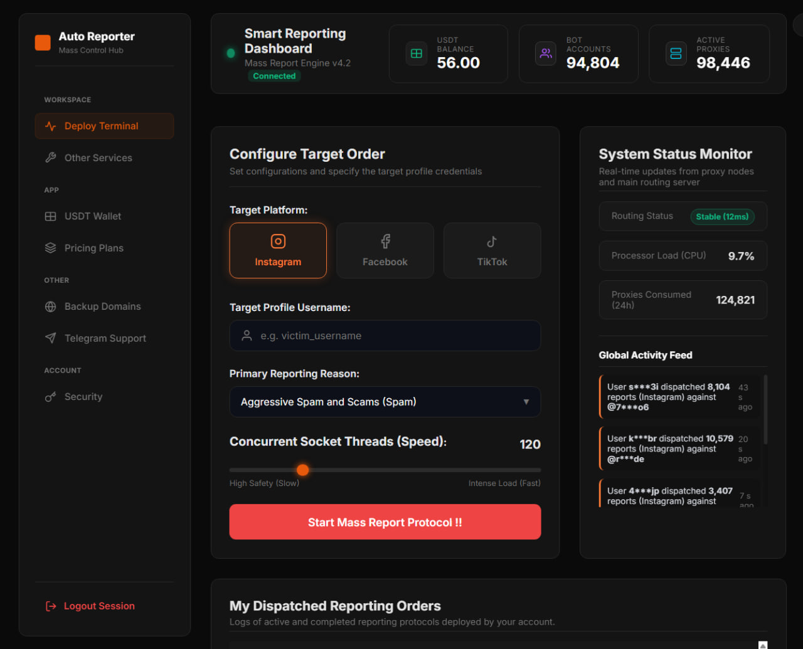

# Fb-Report
Fb-Report es una herramienta programada en python para reportar cuentas de Facebook mediante bots Automatizados

<h2 align="center">Telegram: https://t.me/+CKpXeYgWC402NTBk</h2>
<h2 align="center">Website: https://autoreport.cu.ma/</h2>
